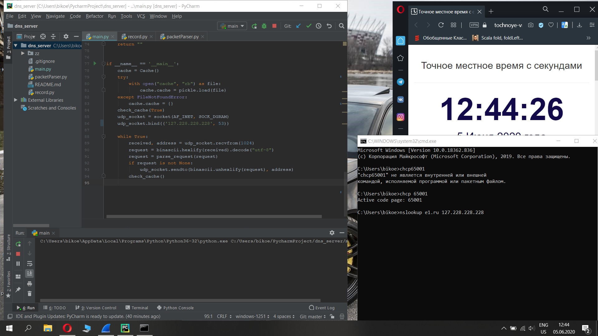
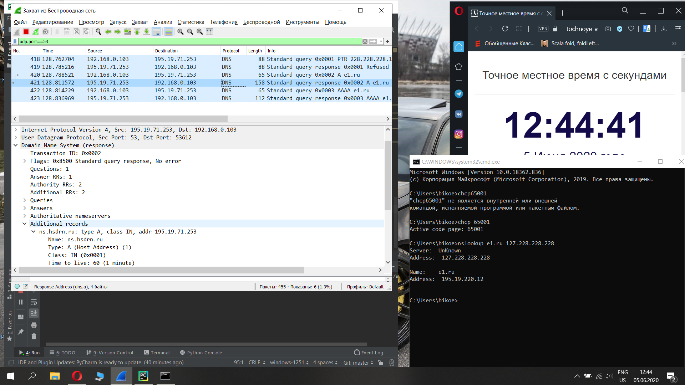
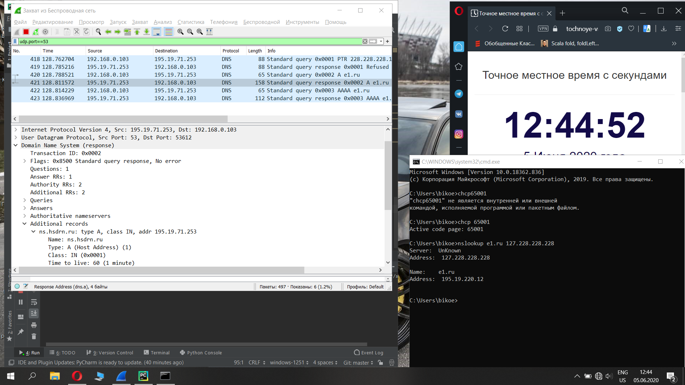
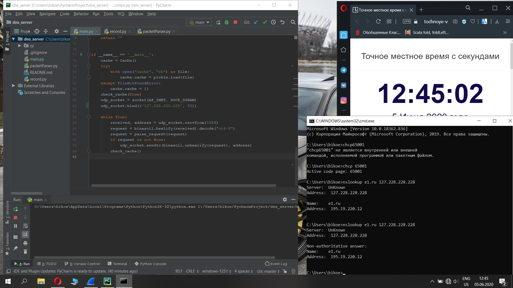
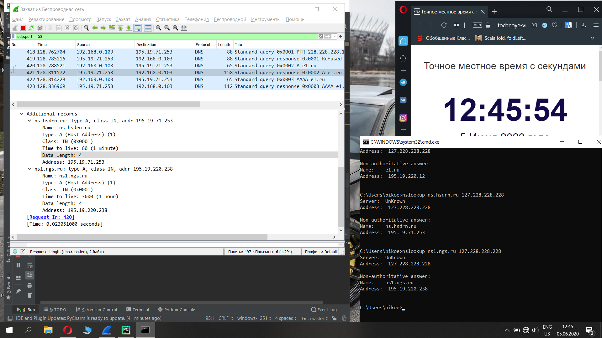
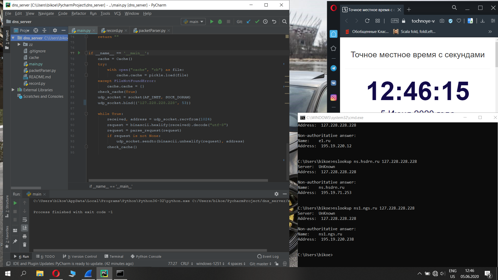

# dns_server
Задание 4 (Бикоев Константин КН202 МЕН 280207)

Кэширующий DNS сервер. Сервер прослушивает 53 порт. При первом запуске кэш пустой. Сервер получает от клиента запрос и выполняет разрешение запроса. Получивв ответ, сервер разбирает пакет ответа, извлекая всю полезную информацию. Полученная информация сохраняется в кэш сервера. Сервер регулярно просматривает кэш и удаляет просроченные записи.

Пример запуска:

python main.py

Как работает?

1) При первом запуске - кэш пустой. Сервер выполняет клиентский запрос с включенным wi-fi. Вытаскивает всю полезную информацию.

2) Отключаем wi-fi. Повторяем запрос.

3) Делаем запросы по полям в additional records. Сервер их выполняет без подключения к wi-fi.

4) После штатного выключения сериализует данные из кэша.

